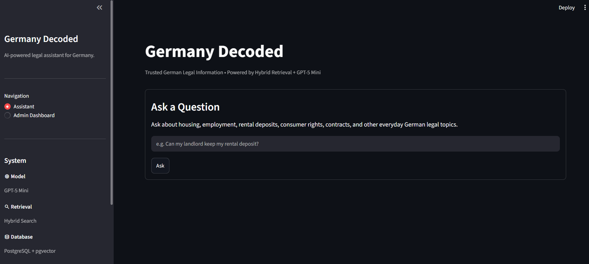
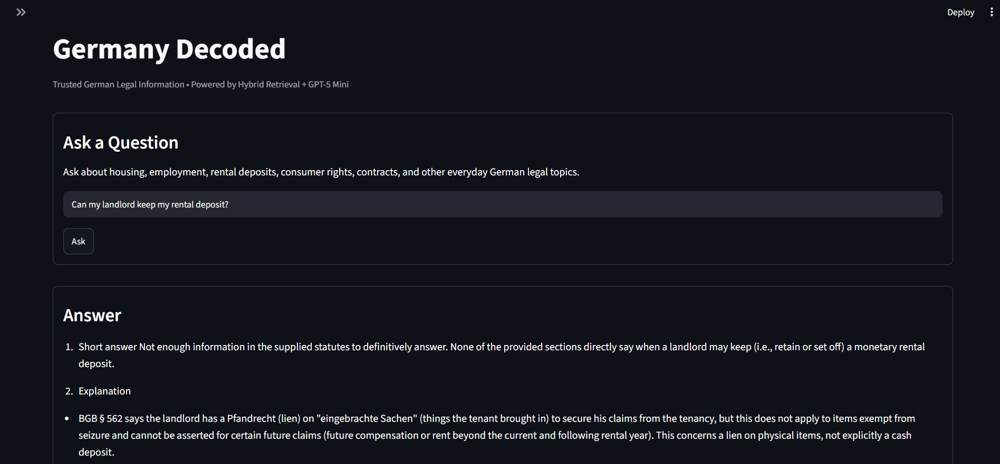
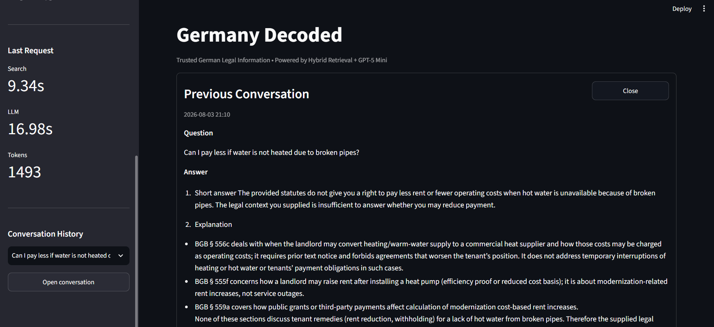
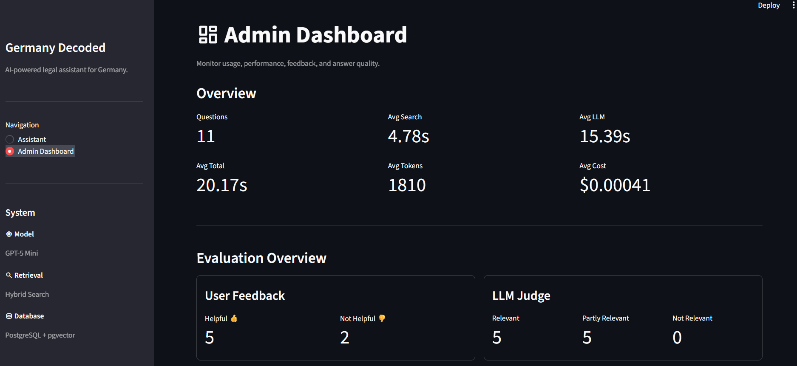
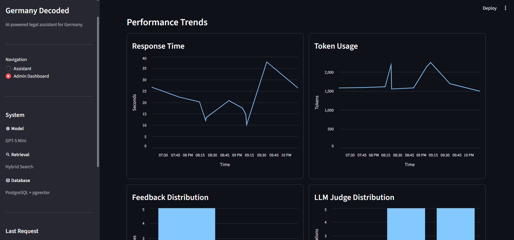
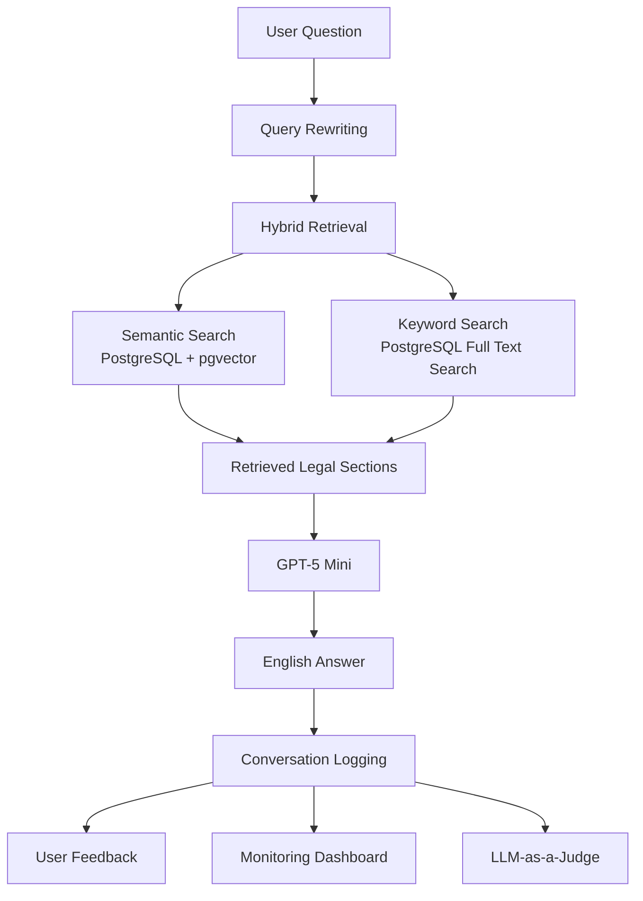

# 🇩🇪 Germany Decoded


<p align="center">

**An AI-powered legal information assistant that helps English-speaking residents understand German law using official legal sources.**

Final project for the **DataTalks.Club LLM Zoomcamp 2026**.

</p>

---

## ✨ Features

- 🇩🇪 Official German Civil Code (BGB) knowledge base
- 🔍 Hybrid Retrieval (Semantic Search + PostgreSQL Full Text Search)
- 🧠 Query Rewriting from English to German legal terminology
- 🤖 GPT-5 Mini grounded answer generation
- 📚 Official legal source references
- 📊 Retrieval benchmark evaluation (Hit@K)
- ⚖️ LLM-as-a-Judge evaluation
- 💬 Conversation history
- 👍 User feedback collection
- 📈 Monitoring dashboard with charts
- 🐘 PostgreSQL + pgvector
- 🐳 Fully containerized application with Docker Compose

---

# Why Germany Decoded?

Living in Germany often means navigating legal information that is:

- written in German,
- spread across multiple official sources,
- filled with legal terminology unfamiliar to many English speakers.

While modern large language models can produce convincing answers, they may also generate unsupported or inaccurate legal information if they are not grounded in authoritative sources.

Germany Decoded addresses this problem by retrieving relevant sections from the **German Civil Code (BGB), currently focusing on German tenancy law (§§ 535–580a)**, before generating an English explanation.

Instead of asking users to search through legal texts themselves, the application combines retrieval techniques with an LLM to produce answers that are both understandable and grounded in official legislation.

The goal is **not** to replace legal professionals, but to make German legal information significantly more accessible.

---

# 📸 Application Preview

The application consists of an AI legal assistant for end users and an integrated Admin Dashboard for monitoring and evaluation.

## Assistant

| Home | Generated Answer |
|------|------------------|
|  |  |

The assistant retrieves relevant legal sections from the German Civil Code (BGB), generates grounded English explanations using GPT-5 Mini, and displays the official sources used to produce the answer.

---

## Monitoring & Administration

| Conversation History | Admin Dashboard |
|----------------------|-----------------|
|  |  |

The integrated Admin Dashboard provides monitoring metrics, recent conversations, user feedback, latency, token usage, estimated API costs, and evaluation results.

---

## Monitoring Charts

<p align="center">



</p>

The monitoring dashboard visualizes application activity using interactive charts, making it easier to inspect system performance and user interactions.

---

## 🎥 Demo Video

https://github.com/user-attachments/assets/7df189c6-aac9-449a-a8e8-e5a5c5e229e1

A short walkthrough demonstrates:

- Asking a legal question
- Hybrid retrieval
- Grounded answer generation
- Conversation history
- Monitoring dashboard
- Evaluation features

---

# 🚀 Project Highlights

This project demonstrates a complete end-to-end Retrieval-Augmented Generation (RAG) pipeline, including:

- automated knowledge ingestion,
- multilingual embeddings,
- hybrid retrieval,
- query rewriting,
- grounded answer generation,
- retrieval evaluation,
- LLM-as-a-Judge evaluation,
- monitoring,
- conversation logging,
- user feedback,
- an integrated Streamlit application.

Unlike the example application developed during the course, Germany Decoded focuses on a real-world legal domain and combines multiple retrieval techniques to improve answer quality.

---

# 🏗️ System Architecture



The application follows a Retrieval-Augmented Generation (RAG) pipeline.

Instead of answering directly from the LLM's internal knowledge, Germany Decoded first retrieves relevant legal information from an official knowledge base and then uses those documents to generate an English explanation.

This approach reduces hallucinations while ensuring that answers are grounded in official legal sources.

---

# ⚙️ How It Works

## 1. Knowledge Ingestion

The project currently builds a searchable legal knowledge base from the **German Civil Code (BGB), focusing on the tenancy law provisions (§§ 535–580a)**. This scope covers many common landlord–tenant questions and serves as the initial knowledge base for the project.

During indexing, the ingestion pipeline:

- loads the legal documents,
- normalizes legal sections,
- generates multilingual embeddings,
- creates PostgreSQL Full Text Search vectors,
- stores everything in PostgreSQL.

Each stored document contains:

- law name,
- section number,
- title,
- legal text,
- language,
- source URL,
- vector embedding,
- search vector.

The downloaded legal texts are **not stored in this repository**. Each user creates a local knowledge base by running the indexing pipeline.

---

## 2. Query Rewriting

Users naturally ask questions in English.

For example:

> Can my landlord keep my deposit?

However, legal documents often use different terminology:

> Mietsicherheit

To bridge this gap, GPT-5 Mini extracts the primary German legal concept from the user's question.

The rewritten concept is used only for the keyword-search branch, while the original English question is still used for semantic retrieval.

---

## 3. Hybrid Retrieval

Germany Decoded combines two complementary retrieval methods.

### Semantic Search

Semantic search retrieves documents based on meaning rather than exact wording.

Document embeddings are stored in PostgreSQL using **pgvector**, and an HNSW index is used for efficient nearest-neighbor search.

### PostgreSQL Full Text Search

Keyword search retrieves documents using official German legal terminology through PostgreSQL's Full Text Search capabilities.

### Hybrid Ranking

Both retrieval methods produce candidate documents.

Their scores are normalized and combined into a hybrid score, allowing the system to benefit from both semantic understanding and exact legal terminology.

The highest-ranked legal sections are then provided to the LLM.

---

## 4. Answer Generation

GPT-5 Mini receives:

- the user's original question,
- the retrieved legal sections,
- system instructions defining the assistant's behavior.

The model is instructed to:

- answer in English,
- rely only on the retrieved legal context,
- avoid unsupported legal claims,
- cite the relevant legal sections,
- communicate uncertainty when the retrieved information is insufficient,
- include a legal-information disclaimer.

The final answer is then returned to the user together with the official legal sources.

---

## 5. Monitoring

Every interaction is stored in PostgreSQL.

The application records:

- user question,
- generated answer,
- retrieved sources,
- latency,
- token usage,
- estimated API cost,
- user feedback,
- timestamps.

These records power the integrated monitoring dashboard and evaluation pipeline.

---

# 📊 Evaluation

Evaluation was an important part of this project. Rather than relying only on manual testing, Germany Decoded includes separate evaluation pipelines for both **retrieval quality** and **generated answers**.

---

## Retrieval Evaluation

The retrieval pipeline is evaluated using a manually created benchmark consisting of representative English legal questions and their expected BGB sections.

Each question specifies one or more legal sections that should be retrieved.

The evaluator measures:

- **Hit@1** – the expected section appears as the top result.
- **Hit@3** – the expected section appears within the first three retrieved documents.
- **Hit@5** – the expected section appears within the first five retrieved documents.

### Retrieval Approaches

Two retrieval strategies were evaluated:

| Approach | Description |
|----------|-------------|
| Semantic Search | Vector similarity using multilingual embeddings stored with pgvector |
| Hybrid Retrieval | Semantic Search combined with PostgreSQL Full Text Search |

### Results

| Metric | Semantic | Hybrid |
|:------:|---------:|-------:|
| Hit@1 | **40%** | 30% |
| Hit@3 | 40% | **70%** |
| Hit@5 | 50% | **70%** |

Although semantic retrieval produced a slightly higher Hit@1 score, hybrid retrieval substantially improved retrieval coverage for the top three and top five results.

Since multiple retrieved documents are passed to the LLM, improving Hit@3 and Hit@5 resulted in better overall answer quality. Therefore, **Hybrid Retrieval** was selected as the default retrieval strategy.

---

## Retrieval Debugger

To simplify retrieval development, the project also includes a retrieval debugger.

For every benchmark question it displays:

- expected legal section(s),
- retrieved documents,
- document titles,
- retrieval scores,
- Hit@K metrics.

This made it easier to compare retrieval strategies and identify failure cases during development.

---

## LLM-as-a-Judge

Retrieval quality alone does not guarantee good answers.

Germany Decoded therefore includes an **offline LLM-as-a-Judge evaluation pipeline**.

Previously generated conversations are evaluated by GPT-5 Mini, which classifies each answer into one of three categories:

- ✅ **RELEVANT**
- 🟡 **PARTLY_RELEVANT**
- ❌ **NOT_RELEVANT**

For every judgment, the model also generates a short explanation describing why the answer received that classification.

Judge results are stored in PostgreSQL and visualized in the Admin Dashboard.

Because judging is performed **offline**, it does not increase latency or API cost for normal users.

---

# 📈 Monitoring

Every user interaction is stored in PostgreSQL.

The monitoring system records:

- question,
- generated answer,
- retrieved sources,
- search latency,
- LLM latency,
- total latency,
- input tokens,
- output tokens,
- estimated API cost,
- user feedback,
- timestamps.

The integrated Admin Dashboard visualizes these metrics using interactive charts.

The dashboard also displays:

- overall application statistics,
- recent conversations,
- user feedback distribution,
- LLM judge results.

---

# ✅ Zoomcamp Requirements

The following table summarizes how Germany Decoded satisfies the LLM Zoomcamp project requirements.

| Requirement | Implementation |
|-------------|----------------|
| Problem Description | English legal assistant for Germany |
| Knowledge Base | Official German Civil Code (BGB) |
| Retrieval Flow | Hybrid Retrieval (Semantic + PostgreSQL Full Text Search) |
| LLM | GPT-5 Mini |
| Retrieval Evaluation | Semantic vs Hybrid retrieval benchmark with Hit@1 / Hit@3 / Hit@5 |
| LLM Evaluation | Offline LLM-as-a-Judge |
| Interface | Streamlit application |
| Ingestion Pipeline | Automated Python ingestion and indexing pipeline |
| Monitoring | Dashboard, 5 charts, conversation logging, user feedback |
| Containerization | Full Docker Compose stack for Streamlit + PostgreSQL/pgvector |
| Reproducibility | README, Makefile, uv, Dockerfile, Docker Compose |

### Implemented Best Practices

- ✅ Hybrid Search
- ✅ Query Rewriting
- ⏳ Document Reranking (planned)

---

# 🚀 Running the Project

Germany Decoded runs as a fully containerized application using Docker Compose.

The Streamlit application, PostgreSQL/pgvector database, indexing pipeline, database initialization, CLI, and evaluation commands can all be executed through Docker.

---

## Requirements

Install:

- Docker
- Docker Compose
- Make
- Git

You also need an OpenAI API key.

Python and uv do not need to be installed locally when using the Docker setup.

---

## 1. Clone the Repository

```bash
git clone https://github.com/besteekmen/germany-decoded.git

cd germany-decoded
```

---

## 2. Configure Environment Variables

Create a `.env` file in the project root.

```env
OPENAI_API_KEY=YOUR_OPENAI_API_KEY

POSTGRES_DB=germany_decoded
POSTGRES_HOST=localhost
POSTGRES_PORT=5432
POSTGRES_USER=admin
POSTGRES_PASSWORD=password
```

Inside Docker Compose, the application automatically connects to the PostgreSQL service using the internal hostname `postgres`.

---

## 3. Set Up the Application

For a fresh installation, run:

```bash
make setup
```

This command:

1. builds the application Docker image,
2. starts PostgreSQL with pgvector,
3. initializes the database,
4. builds the BGB knowledge base,
5. starts the Streamlit application.

The first setup may take several minutes because the embedding model needs to be downloaded.

---

## 4. Open the Application

After setup, open:

http://localhost:8501

The Streamlit application contains:

- Assistant
- Admin Dashboard

The Admin Dashboard is controlled by the following constant inside `app.py`:

`ADMIN = True`

Set it to:

`ADMIN = False`

to expose only the user-facing assistant.

---

## 5. Start and Stop the Application

Start the complete Docker Compose stack:

```bash
make up
```

Stop it:

```bash
make down
```

Check running containers:

```bash
make ps
```

View Streamlit logs:

```bash
make logs
```

---

## 6. Database and Knowledge Base

Initialize the database:

```bash
make init-db
```

Recreate all database tables:

```bash
make reset-db
```

Build or rebuild the legal knowledge base:

```bash
make index
```

Open PostgreSQL:

```bash
make psql
```

The indexing pipeline:

1. loads the official BGB documents,
2. normalizes the legal sections,
3. generates embeddings,
4. creates PostgreSQL Full Text Search vectors,
5. stores everything in PostgreSQL.

Downloaded legal texts are processed during indexing and are not stored in this repository.

---

## 7. Run Evaluation

Run the complete evaluation pipeline:

```bash
make eval-all
```

Run retrieval evaluation:

```bash
make eval-retrieval
```

Run the offline LLM-as-a-Judge evaluation:

```bash
make eval-judge
```

Inspect retrieval behaviour:

```bash
make debug-retrieval
```

All evaluation commands run inside the application Docker container.

---

## 9. Additional Commands

| Command | Description |
|----------|-------------|
| `make setup` | Build and set up the complete application from scratch |
| `make build` | Build the application Docker image |
| `make up` | Start the full Docker Compose stack |
| `make down` | Stop the Docker Compose stack |
| `make ps` | Show running containers |
| `make logs` | Follow Streamlit container logs |
| `make psql` | Open PostgreSQL |
| `make init-db` | Initialize database tables and indexes |
| `make reset-db` | Recreate all database tables |
| `make index` | Build/rebuild the legal knowledge base |
| `make cli` | Run the console assistant inside Docker |
| `make app` | Launch the Streamlit application |
| `make eval-all` | Run both evaluation pipelines |
| `make eval-retrieval` | Run retrieval evaluation |
| `make eval-judge` | Run LLM-as-a-Judge |
| `make debug-retrieval` | Debug retrieval results |

---

# 🛠️ Technology Stack

| Category | Technology |
|-----------|------------|
| Language | Python |
| User Interface | Streamlit |
| LLM | GPT-5 Mini |
| Embeddings | Sentence Transformers |
| Database | PostgreSQL |
| Vector Search | pgvector |
| Keyword Search | PostgreSQL Full Text Search |
| Retrieval | Hybrid Retrieval |
| Monitoring | Streamlit Dashboard |
| Containerization | Docker Compose |
| Environment | uv |

---

# 📁 Repository Structure

```text
germany-decoded/
│
├── app.py                    # Streamlit application
├── Dockerfile.py             # Application container
├── docker-compose.yaml       # Application + PostgreSQL/pgvector
├── .dockerignore
├── Makefile
├── README.md
├── DEVLOG.md
├── TODO.md
├── SOURCES.md
│
└── src/
    └── germany_decoded/
        ├── assistant.py
        ├── retrieval.py
        ├── rewrite.py
        ├── ingestion.py
        ├── embeddings.py
        ├── metrics.py
        │
        ├── loaders/
        │   └── bgb.py
        │
        ├── db/
        │   ├── conversation.py
        │   ├── feedback.py
        │   ├── judge.py
        │   ├── monitoring.py
        │   └── ...
        │
        └── evaluation/
            ├── retrieval_eval.py
            ├── judge_eval.py
            ├── debug_retrieval.py
            └── retrieval_benchmark.json

```

---

# 📚 Additional Documentation

The repository also contains:

| File | Purpose |
|------|---------|
| `DEVLOG.md` | Engineering decisions and development log |
| `TODO.md` | Project roadmap |
| `SOURCES.md` | Official data sources |

---

# 🚧 Current Limitations

Like any retrieval-based application, Germany Decoded has several current limitations.

- The knowledge base currently focuses on the German Civil Code (BGB).
- The retrieval benchmark currently contains a limited set of representative legal questions.
- The LLM Judge evaluates answer relevance rather than legal correctness.
- Conversation history is read-only and is not used as long-term conversation memory.
- Some legal questions may require additional official sources that are not yet included in the knowledge base.

These limitations also represent opportunities for future development.

---

# 🔮 Future Work

Planned improvements include:

## Knowledge Base

- Expand beyond the current tenancy law scope (§§ 535–580a) to additional BGB sections.
- Add other official German legal and governmental sources.
- Support multi-source retrieval.

## Retrieval

- Experiment with improved chunking strategies.
- Implement document reranking.
- Explore alternative embedding models.

## Assistant

- Official web-search fallback.
- Upload and explain official German documents.
- Deadline extraction from official letters.
- Draft response letters.
- Multi-turn conversation memory.

## Infrastructure

- Deploy the application publicly.
- Add OpenTelemetry tracing.
- Add production observability dashboards.

---

# 🤝 Acknowledgements

This project was developed as the final project for the **DataTalks.Club LLM Zoomcamp 2026**.

The project builds upon concepts introduced throughout the course, including:

- Retrieval-Augmented Generation (RAG)
- Hybrid Retrieval
- Query Rewriting
- Retrieval Evaluation
- LLM-as-a-Judge
- Monitoring and Feedback
- PostgreSQL + pgvector
- Streamlit Applications

The application itself, dataset, architecture, implementation, and engineering decisions were designed specifically for this project.

---

# 📜 Data Sources

Germany Decoded currently indexes a curated subset of the German Civil Code (BGB), specifically the tenancy law provisions **§§ 535–580a**, obtained from **Gesetze im Internet**, the official legal portal of the German Federal Ministry of Justice. Future versions will expand the knowledge base with additional BGB sections and other official German legal sources.

The current knowledge base is built from the **German Civil Code (BGB)** available through **Gesetze im Internet**, published by the German Federal Ministry of Justice.

Downloaded legal texts are processed locally during indexing and are **not redistributed through this repository**.

Additional details can be found in:

- `SOURCES.md`

---

# ⚠️ Disclaimer

Germany Decoded provides **legal information**, not legal advice.

Although every answer is grounded in retrieved official legal sources, the application may not retrieve every relevant provision and should not be relied upon as the sole basis for legal decisions.

Users should always:

- consult the cited official sources,
- verify important legal information,
- seek advice from a qualified legal professional when appropriate.

---

# 📄 License

This project is released under the **MIT License**.

See the `LICENSE` file for details.
